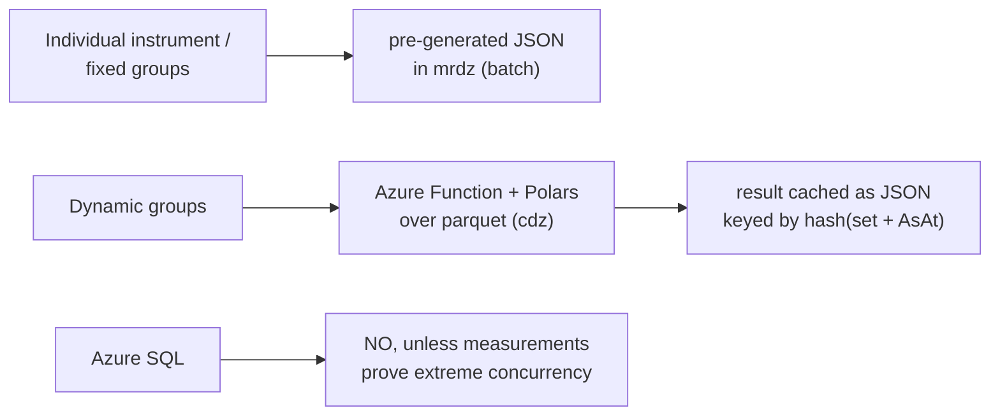
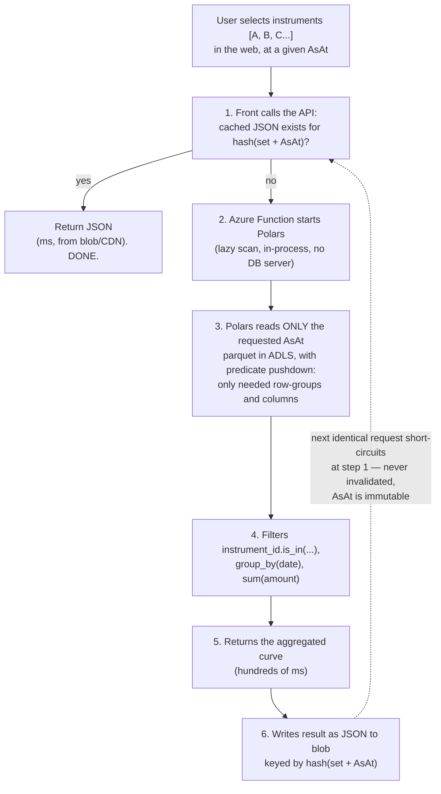

# Serving Detail Data (Cashflows) — Architecture Recommendation

Status: proposed · reference implementation in [reference/cashflows-api/](reference/cashflows-api/)
Scope: how to expose semi-aggregated, heavy detail data (e.g. cashflows per instrument or per group of instruments) on the Quant platform without breaking the low-cost premise of the current parquet-based backend.

## Context

The backend lives in Synapse and works primarily off parquet files, readable via
Serverless SQL or directly from ADLS with Python. The data lake is organized in three zones:

- **rdz (raw data zone)** — raw data as it lands from sources (Excel, JSON, CSV, on-prem DB queries, etc.).
- **cdz (curated data zone)** — cleaned and structured data, typically partitioned by `AsOf`, other business variables, and finally `AsAt` (the snapshot date).
- **mrdz (model results data zone)** — JSON files with aggregated results, ready to display. This is the normal data source for a platform like this: pre-computed, display-ready outputs.

The mrdz→JSON pattern is cheap and fast, but it only works for **outputs you can enumerate ahead of time**. Some data we want to expose is less aggregated — cashflows tied to a specific instrument or to an arbitrary group of instruments — and part of the requirement is **dynamic grouping** (the user picks instruments freely), on a portfolio of ~20,000 assets.

## The key decision variable

The question is not "JSON vs SQL". It is:

> Are the "groups" a finite, predefined set (portfolios, asset classes, regulatory buckets), or arbitrary combinations the user assembles on the fly?

- **Individual instrument** → always enumerable. One entity per instrument.
- **Predefined groups** → also enumerable. Pre-generate one per group.
- **Ad-hoc / dynamic groups** → combinatorial explosion. Pre-generated JSON cannot cover `2^N` combinations of 20,000 assets. This case **requires a query engine**.

Because the requirement includes dynamic groups, we need compute-on-read for that path. Predefined groups and single instruments stay on the cheap pre-computed path.

## Why storage cost is not the deciding factor

Duplicating data into mrdz is often feared as "filling mrdz with repeated data". In cost terms this fear is miscalibrated:

- ADLS / blob storage costs ~US$0.018–0.02 / GB / month. Repeating cashflows per `AsAt` snapshot is economically negligible.
- The real cost of the JSON option is **(1) regeneration compute** and **(2) rigidity** against queries you did not anticipate — not storage.

So the choice should be driven by the **access pattern**, not by storage duplication.

## Sizing the "heavy" data

Cashflows are the heaviest dataset we have, but they are small for a columnar engine. Worst realistic case (monthly buckets, ~30-year horizon ≈ 360 flows per instrument):

- ~7.2M rows **per AsAt snapshot**
- ~100–300 MB in compressed parquet per snapshot

A columnar engine (Polars / parquet) filters `instrument_id IN (...)` and aggregates by date over that in **hundreds of milliseconds**. What is heavy for JSON is light for columnar — this is exactly what parquet was designed for.

## Why columnar over parquet beats Azure SQL here

A group's cashflow is **additive**: the group curve = sum of member instruments' flows bucketed by date. That is a pure `group_by` over columns. A columnar engine beats a row-store SQL database on this workload **by design**, not just on price. Azure SQL would cost always-on billing to do *worse* what parquet does cheaply.

Azure SQL is only justified under very high concurrency (thousands of simultaneous users), which is not the profile of an internal investment portal. Do not adopt it as the default; adopt it only if measurements prove the parquet path cannot meet latency/concurrency targets.

## Options compared

| Option | Latency | Cost | When |
|---|---|---|---|
| **JSON in mrdz** (per instrument / predefined group) | ~ms (CDN-cacheable, static serve) | minimal (storage + generation compute) | Enumerable entities, known hot path |
| **Serverless SQL over parquet** (already available) | seconds, cold start | US$5 / TB scanned | Ad-hoc, low concurrency, tolerates latency |
| **Azure Function + Polars over parquet** | ~hundreds of ms | ephemeral compute only, no always-on DB | Ad-hoc + interactive, low cost |
| **Azure SQL DB** | single-digit ms, indexed | vCore always-on (does not pause when customer-facing) | Ad-hoc + interactive + very high concurrency |

## Recommended architecture

**1. Cashflows in cdz as a parquet dataset, partitioned by `AsOf / AsAt`.**
Do **not** partition by instrument (20k partitions = thousands of tiny files, an anti-pattern). Within each snapshot, **sort/cluster by `instrument_id`** so the engine can do predicate pushdown via row-group statistics. Aim for one (or few) files per `AsAt`.

**2. A thin API (Azure Function) running Polars over that parquet.**
It receives the dynamic group's instrument list → filters → aggregates by date → returns the curve. No always-on database; you pay only for execution. Polars is the default engine here: it is already the columnar/dataframe library in active use and approved for this stack, so the Function reuses tooling the team already runs in production rather than introducing a new dependency.

**3. A hash-keyed cache that bridges dynamic flexibility with JSON speed — the key piece.**
When a dynamic group arrives, compute it with Polars and **write the result as JSON to blob, keyed by `hash(instrument_set + AsAt)`**. Because `AsAt` snapshots are **immutable**, this cache **never needs invalidation** for a given `AsAt`. The next identical request serves JSON from blob/CDN in milliseconds at zero compute cost. This is effectively **lazily materialized mrdz** — you only materialize what was actually requested, not the full combinatorial universe.

**4. Predefined groups (portfolios, asset classes) are pre-generated as JSON in mrdz** during the batch run. Same cache, just warmed ahead of time — zero wait for the known hot path.

### Decision rule



## The core concept: compute-on-read vs precompute-on-write

The difference from mrdz is not technology — it is **when the compute happens**.

| | mrdz (today) | Function + Polars |
|---|---|---|
| **When it computes** | On write (batch, ahead of time) | On read (per request, on demand) |
| **What it stores** | The final aggregated result | Nothing new — reads the detail in cdz |
| **Read path** | Fetch a dumb file (no CPU) | Runs a query in the moment |
| **Good for** | Known, enumerable outputs | Unknown / dynamic outputs |

mrdz materializes results you already know someone will ask for: the batch runs once, leaves the JSON ready, and the web just does a `GET` of a static file. Fast and cheap — but only works if you can enumerate everything in advance. Dynamic groups cannot be enumerated.

The Function + Polars path inverts this: there is no pre-materialized result. When the request arrives with the instrument list, only then is the cdz parquet read, filtered, and aggregated. The hash cache is the bridge: compute on-read once, then persist as JSON so that group behaves like mrdz from then on.

Analogy: mrdz = "cook the dish and leave it served"; Function + Polars = "cook to order from the ingredients in cdz, and store the plate in the fridge (cache) in case it's ordered again."

## Request flow (dynamic group)



Key point at step 3: Polars does **not** load the whole parquet into memory or copy it. `scan_parquet` builds a lazy plan; only when `.collect()` runs does it read byte ranges directly from blob (via its native Azure/`object_store` backend), using the parquet's row-group statistics to skip everything that does not match the filter. That is why a 100–300 MB snapshot resolves in hundreds of ms even when it lives in ADLS.

## The mechanics: why "hundreds of ms" is realistic

The pattern rests on three properties that line up unusually well:

1. **Parquet is self-describing and chunked.** A parquet file is divided into *row groups* (typically 100k–1M rows), and the footer stores min/max statistics per column per row group. An engine can read just the footer (a few KB) and know "instrument `INS-014` can only be in row groups 3 and 17" — before touching any data.
2. **Polars reads byte ranges, not files.** Its native cloud reader (built on the Rust `object_store` crate) issues HTTP range requests against ADLS: footer first, then only the row groups that survive the filter (**predicate pushdown**, `.filter(pl.col("instrument_id").is_in([...]))`) and only the columns in the query (**projection pushdown**, selecting `bucket_date`/`amount`). For a 300 MB snapshot where the request wants 50 instruments × 3 columns, only a few MB actually leave the storage account. This happens automatically whenever the query is built lazily (`scan_parquet` → `.filter()`/`.select()` → `.collect()`).
3. **Polars is embedded.** It is a Rust engine with Python bindings (PyO3) inside the Function process — starts in milliseconds, no server, no connection pool. The unit of compute is the Function invocation itself, so cost is strictly per request. See Polars' own writeup on lazy execution and query optimization in the [user guide](https://docs.pola.rs/user-guide/lazy/optimizations/), which covers the same pushdown mechanics DuckDB documents for its engine.

## Getting that performance in practice

Pushdown is only as good as the file layout lets it be. Checklist, in order of leverage:

- **Sort the data inside each snapshot by `instrument_id`** (already in recommendation #1). Row-group statistics only prune if values are clustered: if instruments are scattered randomly, every row group's min/max spans the whole ID range and the engine must read everything. One `sort("instrument_id")` at write time is the single highest-leverage optimization.
- **Few large files, not many small ones.** 20k per-instrument partitions means 20k footers to fetch — thousands of round trips before any data moves. One file (or a handful) per `AsOf/AsAt` is right; default row-group sizes (~122k rows) are fine. See Polars' [performance guide](https://docs.pola.rs/user-guide/io/cloud-storage/) for cloud reads.
- **Partition only by what every query filters on** — Hive-style `AsOf=/AsAt=` directories, so partition pruning eliminates whole snapshots before any I/O. That is what `cashflows_glob()` in the reference implementation encodes.
- **Verify pushdown empirically** with `LazyFrame.explain()`: it prints the optimized query plan, showing the filter/projection pushed down into the `PARQUET SCAN` node (add `.explain(optimized=False)` to compare against the naive plan). If the scan node shows no pushed-down predicate, sorting or statistics are off and you are paying for full scans without noticing. `.profile()` gives per-node timings for the same diagnosis.
- **Co-locate Function and storage account in the same region.** Range requests are chatty; cross-region latency multiplies per round trip.
- **Local dev needs no Azure**: the same Polars code runs against local parquet files by swapping the glob path — prototype the whole API with `func start` and synthetic parquet on disk before touching ADLS.

## Reference code

**Polars (default):**
```python
import polars as pl

lf = pl.scan_parquet(
    f"abfss://cdz@myaccount.dfs.core.windows.net/cashflows/AsOf={asof}/AsAt={asat}/*.parquet",
    storage_options={"account_name": "myaccount", "bearer_token": token},
)
result = (
    lf.filter(pl.col("instrument_id").is_in(ids))
      .group_by("bucket_date")
      .agg(pl.col("amount").sum().alias("cashflow"))
      .sort("bucket_date")
      .collect()   # lazy: filter/projection are pushed down into the scan
)
```

Note: `scan_parquet` + `.collect()` is *lazy* — Polars pushes the filter and column selection into the read. Using `read_parquet` (eager) would read everything first; `scan_` avoids that. `token` above is a short-lived AAD bearer token obtained via `DefaultAzureCredential().get_token("https://storage.azure.com/.default").token` — see the reference implementation for the exact wiring.

**DuckDB (alternative engine, same logic):**
```python
import duckdb

con = duckdb.connect()
con.sql("INSTALL azure; LOAD azure;")
con.sql("CREATE SECRET (TYPE AZURE, PROVIDER CREDENTIAL_CHAIN, ACCOUNT_NAME 'myaccount');")

path = f"abfss://cdz@myaccount.dfs.core.windows.net/cashflows/AsOf={asof}/AsAt={asat}/*.parquet"
query = f"""
    SELECT bucket_date, SUM(amount) AS cashflow
    FROM read_parquet('{path}')
    WHERE instrument_id IN ({','.join(['?']*len(ids))})
    GROUP BY bucket_date ORDER BY bucket_date
"""
result = con.execute(query, ids).fetch_arrow_table()
```

## Polars vs DuckDB for this case

Both work — this is not a capability gap, it's a default-vs-alternative call. For "serve aggregations from remote parquet on ADLS", **Polars is the default** for this project:

**Why Polars is the default here:**

- **Already heavily used and approved on this stack** — the architect and team already run Polars in production, so the Function reuses a dependency that is already vetted, familiar, and operationally understood. That is a bigger practical win than a marginal engine-level difference for a workload this small.
- The DataFrame API composes naturally with the rest of the Python codebase (config, cache, request handling) without context-switching into embedded SQL strings.
- Same lazy pushdown guarantees as DuckDB for this workload (`scan_parquet` → filter/projection pushdown → `collect()`); at ~100–300 MB per snapshot, both engines resolve in hundreds of ms — the difference between them is noise at this scale.
- If cashflow transformation grows in complexity later (discounting flows, applying scenarios, curves, joins with other datasets), Polars' DataFrame API scales with that complexity better than hand-built SQL strings.

**DuckDB remains a reasonable fallback when:**

- The team wants to express the aggregation as SQL directly (e.g. handing the query to someone who thinks in SQL, or reusing a query written for Serverless SQL with minimal changes).
- A future dataset is much larger than memory and benefits from DuckDB's out-of-core streaming execution beyond what Polars' streaming engine covers.

**Recommendation:** default to **Polars** for every new compute-on-read path on this platform, including this one — it is already the standard, allowed engine here, and it fully covers "filter by instruments + aggregate by date + serve" with no loss of performance at this data volume. Reach for DuckDB only if a specific future workload demonstrates a concrete advantage (e.g. a SQL-first consumer or an out-of-core dataset) that Polars cannot match — don't introduce it as a second engine by default.

## Operational notes

- **Function cold start / hosting plan:** Polars itself starts in milliseconds (it's a Rust binary with a thin Python wrapper); the cost is the Python/Function host spinning up after idle. The recommended home today is the **[Flex Consumption plan](https://learn.microsoft.com/en-us/azure/azure-functions/flex-consumption-plan)** (GA since late 2024, [announcement](https://techcommunity.microsoft.com/blog/appsonazureblog/azure-functions-flex-consumption-is-now-generally-available/4298778)): pay-per-use billing, but with **always-ready instances** configurable per function to eliminate the cold start, and per-instance memory sizing (relevant because the aggregation's hash table and Arrow buffers want headroom). Python 3.11 supported. This supersedes the older "Premium plan with one warm instance" workaround. The hash cache amortizes cold starts regardless — repeat hits never touch the Function.
- **Memory:** size the Function for the largest AsAt snapshot × concurrency. With 100–300 MB per snapshot and pushdown, a modest plan is plenty. Monte Carlo scenarios (see open questions) would change this.
- **Concurrency:** each invocation is isolated and stateless — they scale horizontally on their own. No shared-DB contention.
- **Auth:** `DefaultAzureCredential` (Managed Identity in Azure, dev credentials locally) mints a short-lived AAD token passed to Polars via `storage_options={"bearer_token": ...}` — no secrets in code. The credential object caches the token in-process until near expiry, so warm invocations don't re-authenticate on every request.

## Where this lands in the Quant front end

The portal side of this pattern already exists: **the Pactos (Repos) module is the mold.** Its plug-in (`js/modules/pactos.js`) declares a data provider that queries the API **per navigation with the global context** (`QuantAPI.get('pactos', { cartera, corte })`), and the shell handles the async lifecycle: loading state, error banner if the API fails, and a render token that discards stale responses.

A cashflows module is the same shape, one level up in dynamism:

1. New plug-in in `js/modules/` registered with `registerModule`, with a `data` provider that POSTs `{ asOf, asAt, instrumentIds }` to this Function (the request contract in [reference/cashflows-api/README.md](reference/cashflows-api/README.md)).
2. The endpoint root comes from `config.js` (`apiBase` per environment) — the same runtime-config mechanism the rest of the portal uses; nothing recompiles.
3. The shell needs no changes: the async render machinery, `esc()` for API-served text, and the empty-data guard convention were all introduced with the Pactos migration.

So the integration order is: deploy the Function → point `config.js` at it → write the module file. Each step is local.

## Open questions that would refine partitioning/sizing

1. **Are cashflows deterministic (contractual calendar) or stochastic (N Monte Carlo trajectories)?** Scenarios multiply volume by N and change the partitioning strategy.
2. **Are all daily AsAt snapshots retained, or only milestones?** This defines how the history grows over time.
3. **Latest-AsAt-per-AsOf resolution** — a Python script used for regular ad-hoc development already implements "pick the latest AsAt for a given AsOf" (not yet shared/ported). The reference Function needs equivalent logic before it can serve requests that only specify `asOf`. See [reference/cashflows-api/README.md#pending-resolve-latest-asat-per-asof](reference/cashflows-api/README.md#pending-resolve-latest-asat-per-asof) for the pending work and its cache-key implication.

## References

**Polars — core reading:**

- [Cloud storage / lazy scans](https://docs.pola.rs/user-guide/io/cloud-storage/) — `scan_parquet` over `abfss://`/`az://`, `storage_options`, credentials; read this first
- [Lazy API / query optimization](https://docs.pola.rs/user-guide/lazy/optimizations/) — predicate/projection pushdown mechanics, `.explain()`, `.profile()`
- [Parquet I/O guide](https://docs.pola.rs/user-guide/io/parquet/) — row-group sizing, statistics, `scan_` vs `read_`

**DuckDB — alternative engine, for calibration:**

- [Azure extension](https://duckdb.org/docs/stable/core_extensions/azure) — `abfss://`, secrets, `CREDENTIAL_CHAIN`; edge cases in the [duckdb-azure repo](https://github.com/duckdb/duckdb-azure)
- [Querying Parquet with Precision](https://duckdb.org/2021/06/25/querying-parquet.html) — pushdown mechanics with benchmarks
- Practitioner walkthrough on Azure: [Quacking Queries in the Azure Cloud with DuckDB](https://medium.com/datamindedbe/quacking-queries-in-the-azure-cloud-with-duckdb-14be50f6e141) (Dataminded)

**Azure Functions:**

- [Flex Consumption plan](https://learn.microsoft.com/en-us/azure/azure-functions/flex-consumption-plan) · [how-to](https://learn.microsoft.com/en-us/azure/azure-functions/flex-consumption-how-to) (always-ready instances, memory sizes)
- [Python developer guide](https://learn.microsoft.com/en-us/azure/azure-functions/functions-reference-python) — the v2 programming model used by the reference implementation
- [Azure Identity / DefaultAzureCredential](https://learn.microsoft.com/en-us/python/api/overview/azure/identity-readme) — Managed Identity chain, no secrets in code

**Other options, for calibration:**

- [Synapse serverless SQL over parquet](https://learn.microsoft.com/en-us/azure/synapse-analytics/sql/query-parquet-files) — already available; the "no code to deploy" fallback at US$5/TB scanned, slower and colder
