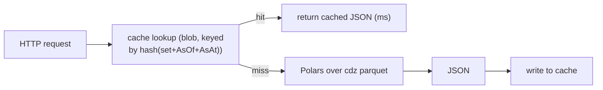

# cashflows-api — reference implementation

A thin Azure Function that serves aggregated cashflow curves for **dynamic groups** of
instruments, following [detail-data-serving-architecture.md](../../detail-data-serving-architecture.md).

It is the **compute-on-read** path: no pre-materialized result. On each request it
either serves a cached JSON (hash of the instrument set + snapshot) or computes the
aggregation with Polars directly over the cdz parquet, then persists the result as JSON
so the next identical request is a cheap cache hit. Polars is the default engine for this
project (already in production use elsewhere in the stack) — see
[the architecture doc](../../detail-data-serving-architecture.md#polars-vs-duckdb-for-this-case)
for the rationale; DuckDB remains a documented fallback but is not the default.



This is a **reference skeleton**, not production code: auth, input validation limits,
observability, and error contracts should be hardened before deployment. Cashflow amounts
here are synthetic-schema placeholders — adapt column names to the real cdz layout.

## Layout

```
function_app.py         HTTP trigger + orchestration (cache → compute → cache)
cashflows/config.py     env-driven configuration
cashflows/cache.py      blob cache: deterministic key, get, put
cashflows/query.py      Polars query over ADLS parquet (predicate pushdown)
requirements.txt        deps (azure-functions, polars, azure-storage-blob)
host.json               Functions host config
local.settings.example.json   local env template (do NOT commit real secrets)
```

## Request contract

`POST /api/cashflows`

```json
{
  "asOf": "2026-07-06",
  "asAt": "2026-07-06",
  "instrumentIds": ["INS-001", "INS-014", "INS-220"]
}
```

Response:

```json
{
  "asOf": "2026-07-06",
  "asAt": "2026-07-06",
  "cacheKey": "b1946ac9…",
  "cached": false,
  "curve": [
    { "bucketDate": "2026-08-31", "cashflow": 1250000.0 },
    { "bucketDate": "2026-09-30", "cashflow":  980000.0 }
  ]
}
```

## Config (env / app settings)

| Setting | Meaning |
|---|---|
| `ADLS_ACCOUNT` | ADLS Gen2 account name (e.g. `micuenta`) |
| `CDZ_CONTAINER` | container/filesystem holding cdz (e.g. `cdz`) |
| `CASHFLOWS_PREFIX` | path prefix of the cashflows dataset (e.g. `cashflows`) |
| `CACHE_CONTAINER` | blob container for materialized results (e.g. `mrdz-cache`) |
| `CACHE_PREFIX` | key prefix inside the cache container (e.g. `cashflows-groups`) |
| `MAX_INSTRUMENTS` | guardrail on group size per request (e.g. `5000`) |

Auth to ADLS and blob uses `DefaultAzureCredential` (Managed Identity in Azure, dev
credentials locally) — no secrets in code.

## Why the cache never needs invalidation

The key includes `AsAt`, and `AsAt` snapshots are **immutable** by construction. A given
`(instrument_set, AsOf, AsAt)` always maps to the same result, so a cached entry is valid
forever. New snapshots simply produce new keys.

## Pending: resolve latest AsAt per AsOf

Today the [request contract](#request-contract) requires the caller to pass an explicit
`asAt`. In practice, some callers only know the business date (`asOf`) and want the
**latest available snapshot** for it — e.g. when intraday corrections produce more than
one `AsAt` per `AsOf` and the caller wants "whatever is freshest right now."

That "pick the latest AsAt for a given AsOf" resolution already exists as a Python script
used for regular ad-hoc development/analysis (outside this repo, not yet shared). It is
**not ported into this Function yet** — `query.py` still requires the exact `AsAt` to be
supplied by the caller.

**To do, once that script is shared:**

- Port its "latest AsAt per AsOf" selection logic into `cashflows/query.py` (or a new
  `cashflows/snapshots.py`), matching its exact rule for "latest" (e.g. lexicographic vs.
  parsed-date max over the `AsAt=` partitions under a given `AsOf=`).
- Decide the request-contract change this implies: make `asAt` optional (resolve to
  latest when omitted) vs. an explicit `"asAt": "latest"` sentinel — follow whatever the
  original script's convention is rather than inventing a new one.
- **Cache-key implication:** `cache_key()` hashes the literal `asAt` string. If `asAt`
  becomes resolved server-side, the key must hash the *resolved* value (not `"latest"`),
  otherwise the [cache-never-invalidates](#why-the-cache-never-needs-invalidation)
  property breaks — two different underlying snapshots would collide on the same key.

This is a placeholder until the reference script is provided — do not implement a guessed
version of "latest" in the meantime.
